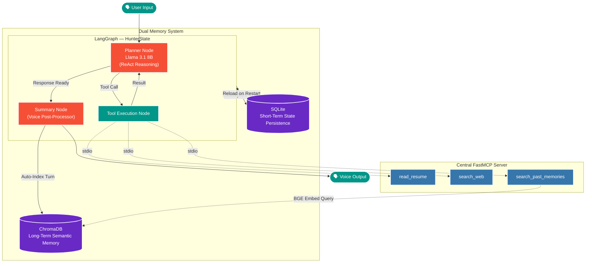
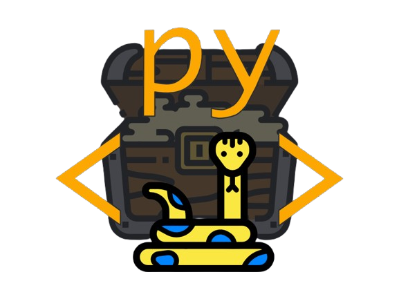

<div align="center">

```text
██   ██  ██   ██  ███   ██  ████████  ███████   ██████    ███████ 
██   ██  ██   ██  ████  ██     ██     ██        ██   ██   ██      
███████  ██   ██  ██ ██ ██     ██     █████     ██████    ███████ 
██   ██  ██   ██  ██  ████     ██     ██        ██   ██        ██ 
██   ██  ███████  ██   ███     ██     ███████   ██   ██   ███████ 
```

### *Your AI-Powered Career Operating System*

<br>

[](https://python.org)
[](https://fastapi.tiangolo.com/)
[](https://groq.com)
[](https://www.sarvam.ai/)
[](https://github.com/Textualize/rich)
[](https://github.com/jlowin/fastmcp)
[](https://langchain.com)
[](https://www.trychroma.com/)
[](https://huggingface.co/BAAI/bge-small-en-v1.5)
[](https://sqlite.org)

<br>

*A hyper-optimized, voice-enabled AI system that listens to you, understands your career goals, and autonomously hunts for job opportunities — like having J.A.R.V.I.S. as your personal career advisor.*

<br>

---

</div>

## 🎯 What is HUNTERS?

**HUNTERS** is an advanced multi-agentic AI career operating system — not a chatbot, not a wrapper, but a fully autonomous pipeline of specialized AI agents that **hunt jobs for you**.

You don't scroll job boards. You don't write cover letters. You don't track applications in spreadsheets. You just **talk**.

Think of it as **J.A.R.V.I.S. meets an elite recruitment agency**, except it works 24/7, never forgets your preferences, and actually submits applications on your behalf.

**The Vision:**
> *"Hunter, find AI Engineering internships in Bangalore, rank them against my profile, draft cover letters for the top 3, and apply to all of them."*

Hunter will listen, understand your intent, delegate tasks across a network of specialized AI agents — Scout, Resume Analyzer, Match, Apply, Outreach, Tracker — orchestrate their work through LangGraph, use MCP tools to interact with real-world systems (browsers, file systems, Notion, Gmail), and speak the results back to you in **real-time**. End-to-end. Fully automated.

---

## ⚡ Real-Time Voice Architecture (New!)

We recently rebuilt Hunter's voice pipeline from the ground up into a highly scalable asynchronous Client-Server architecture to achieve **zero-latency, conversational AI interactions**.

```text
      🎙 You Speak (Voice Mode) / ⌨️ You Type (Text Mode)
            │
            ▼
     ┌──────────────┐
     │ VAD Listener │  ← Silero VAD detects voice & locks out noise
     └──────┬───────┘
            │
            ▼
     ┌──────────────┐
     │  FastAPI WS  │  ← Streams audio bytes over WebSockets
     └──────┬───────┘
            │
            ▼
     ┌──────────────┐
     │  Sarvam STT  │  ← Ultra-fast Speech-to-Text inference
     └──────┬───────┘
            │
            ▼
     ┌──────────────┐
     │ Hunter Graph │  ← LangGraph ReAct Loop (Planner ↔ Tools)
     │ (ChatGroq)   │  ← FastMCP tools: read_resume, search_web
     └──────┬───────┘
            │
            ▼
     ┌──────────────┐
     │Local Edge TTS│  ← Client chunks text & runs neural TTS locally for zero lag
     └──────┬───────┘
            │
            ▼
       🗣 You Hear Hunter (Real-time concurrent playback!)
```

### 🔥 Key Optimizations & Fixes
- **Client-Side Edge TTS:** TTS generation was moved from the server directly to the client. This cuts out an entire network hop, meaning Hunter starts speaking the very millisecond the first sentence is generated!
- **Asynchronous Concurrent Playback:** Utilizing pure `asyncio` and `miniaudio`, the audio stream buffers and plays chunks concurrently as they download, preventing deadlocks and buffering lag.
- **Groq LLM Acceleration:** Switched to Groq's high-speed inference for Llama 3.1, making the AI's "thought process" nearly instantaneous.
- **VAD Processing Lock:** The microphone now intelligently mutes itself (`is_processing`) while Hunter is processing and speaking, eliminating the dreaded "one-word mid-sentence reset" bug.
- **3D Pixel UI:** Built a gorgeous custom 3D drop-shadow CLI interface natively into Rich, replacing standard fonts.

---

## 🧠 Hunter's LangGraph Architecture

Hunter's brain is a **ReAct (Reason + Act)** Agent built on LangGraph — capable of autonomously reasoning, calling tools, and maintaining memory across restarts.


```mermaid
graph TD
    User(["🗣️ User Input"]) --> Planner

    subgraph Graph ["LangGraph — HunterState"]
        Planner["Planner Node\nLlama 3.1 8B\n(ReAct Reasoning)"] -- Tool Call --> ToolNode
        ToolNode["Tool Execution Node"] -- Result --> Planner
        Planner -- Response Ready --> Summary
        Summary["Summary Node\n(Voice Post-Processor)"]
    end

    subgraph MCP ["Central FastMCP Server"]
        ToolNode -. stdio .-> read_resume
        ToolNode -. stdio .-> search_web
        ToolNode -. stdio .-> search_past_memories
    end

    subgraph Memory ["Dual Memory System"]
        Summary -- Auto-Index Turn --> ChromaDB[("ChromaDB\nLong-Term Semantic Memory")]
        Graph -- Checkpoint State --> SQLite[("SQLite\nShort-Term State Persistence")]
        search_past_memories -. BGE Embed Query .-> ChromaDB
        SQLite -. Reload on Restart .-> Graph
    end

    Summary --> Out(["🗣️ Voice Output"])

    classDef llm fill:#f55036,stroke:#fff,stroke-width:2px,color:#fff;
    classDef node fill:#009688,stroke:#fff,stroke-width:2px,color:#fff;
    classDef mcp fill:#3776AB,stroke:#fff,stroke-width:2px,color:#fff;
    classDef mem fill:#6929C4,stroke:#fff,stroke-width:2px,color:#fff;

    class Planner,Summary llm;
    class ToolNode node;
    class read_resume,search_web,search_past_memories mcp;
    class ChromaDB,SQLite mem;
```

### 🧠 Dual Memory — How It Works

Hunter has two independent memory systems working in parallel:

| Memory Layer | Technology | Purpose |
|---|---|---|
| **Short-Term (State)** | SQLite + `AsyncSqliteSaver` | Persists the full LangGraph message state across restarts. Restart `app.py` and Hunter picks up right where it left off. |
| **Long-Term (Semantic)** | ChromaDB + `BAAI/bge-small-en-v1.5` | Every completed conversation turn is embedded and indexed. Hunter can recall preferences, past searches, and prior context via `search_past_memories`. |

**Flow:** After every turn, `summary_node` auto-indexes the conversation into ChromaDB via FastEmbed. When needed, the `search_past_memories` MCP tool performs a cosine-similarity semantic search to surface relevant past context.

---

## 🛠️ Tech Stack

<table>
<tr>
<td align="center" width="120">

<br><strong>Python</strong>
<br><sub>3.12+</sub>
</td>
<td align="center" width="120">

<br><strong>FastAPI</strong>
<br><sub>WS Server</sub>
</td>
<td align="center" width="120">

<br><strong>LangGraph</strong>
<br><sub>Agent Orchestration</sub>
</td>
<td align="center" width="120">

<br><strong>FastMCP</strong>
<br><sub>Stdio Tool Server</sub>
</td>
</tr>
<tr>
<td align="center" width="120">

<br><strong>Groq</strong>
<br><sub>Llama 3.1 8B</sub>
</td>
<td align="center" width="120">

<br><strong>Sarvam AI</strong>
<br><sub>Ultra-fast STT</sub>
</td>
<td align="center" width="120">

<br><strong>Edge TTS</strong>
<br><sub>Streaming Neural TTS</sub>
</td>
<td align="center" width="120">

<br><strong>Rich</strong>
<br><sub>CLI UI</sub>
</td>
</tr>
</table>

---

## 📦 Project Structure

```
hunters/
├── app.py                        # CLI entry point — Voice/Text mode selector
│
├── agents/
│   ├── hunter.py                 # HunterAgent — orchestrates the LangGraph run
│   └── graphs/
│       ├── hunter_graph.py       # Graph builder — MCP client, nodes, edges
│       ├── hunter_state.py       # HunterState TypedDict (messages, intent, response)
│       ├── planner.py            # Planner node — ReAct reasoning, tool binding
│       ├── summary.py            # Summary node — voice post-processor + memory indexing
│       └── groq_llm.py           # Shared ChatGroq LLM instance
│
├── context/
│   ├── context_builder.py        # Lean system prompt builder (5-layer, tool-first)
│   └── memory_store.py           # ChromaDB + BGE-small-en embeddings (long-term memory)
│
├── mcp_server/
│   ├── central_server.py         # FastMCP stdio server — registers all tools
│   └── tools/
│       ├── resume_read.py        # read_resume — reads workspace_profile/ files
│       ├── web_search.py         # search_web — Tavily live internet search
│       └── memory_tool.py        # search_past_memories — Chroma semantic search
│
├── server/
│   ├── voice_server.py           # FastAPI WebSocket server (Voice Mode)
│   └── sarvam_stt.py             # Sarvam AI STT client
│
├── voice/
│   ├── vad_listener.py           # Silero VAD continuous voice detection
│   ├── stream_tts.py             # Sentence chunker & Edge TTS streaming
│   └── audio_stream.py           # Async miniaudio concurrent playback
│
├── workspace_profile/            # Drop your resume/portfolio here (not committed)
│   └── resume.md
│
├── .data/                        # Runtime data (not committed)
│   ├── hunter_state.db           # SQLite — short-term state persistence
│   └── chroma_db/                # ChromaDB — long-term semantic memory
│
├── config/
│   └── settings.py               # App-wide constants (model IDs, paths, URLs)
│
├── sub_agents/                   # 🔜 Scout, Match, Apply, Outreach agents
├── prompts/                      # 🔜 Agent system prompts library
├── templates/                    # 🔜 Cover letter & resume templates
├── tests/                        # 🔜 Unit & integration tests
│
├── requirements.txt
└── .env                          # API keys (never committed)
```

---

## 🚀 Quick Start

### Prerequisites
- Python 3.12+
- A microphone
- Groq API Key
- Sarvam AI API Key

### Installation

```bash
# Clone the repository
git clone https://github.com/wade-wilson-00/HUNTERS---Multi-agentic-AI-Job-application-system.git
cd HUNTERS---Multi-agentic-AI-Job-application-system

# Create virtual environment
python -m venv venv
venv\Scripts\activate        # Windows
# source venv/bin/activate   # macOS/Linux

# Install dependencies
pip install -r requirements.txt

# Set up your environment variables
# Create a .env file with:
GROQ_API_KEY=your_groq_api_key_here
SARVAM_API_KEY=your_sarvam_api_key_here
```

### Run Hunter

```bash
# 1. Start the Voice WebSocket Server
python -m server.voice_server

# 2. Start the Client (in a new terminal)
python app.py
```

The app supports two modes:
- **Voice Mode**: Speak naturally. Hunter uses Silero VAD to know when you've stopped speaking and replies automatically.
- **Text Mode**: Use standard keyboard input if you prefer not to talk, while still getting voice responses.

---

## 📋 Development Progress

### ✅ Week 1 — Hunter Core (Voice Assistant) `COMPLETED`

The foundational voice-to-voice loop is fully operational.

| Feature | Status | Description |
|---------|--------|-------------|
| Voice Server | ✅ Done | FastAPI WebSocket server handling bi-directional audio/text streaming |
| Microphone Listener | ✅ Done | Fast voice activity detection using **Silero VAD** |
| Speech-to-Text | ✅ Done | Rapid cloud transcription using **Sarvam AI** |
| LLM Brain | ✅ Done | Meta Llama 3.1 (8B) via **Groq** with SSE streaming |
| Text-to-Speech | ✅ Done | Ultra-realistic, fast, streaming neural voice using **Edge TTS** |
| CLI Interface | ✅ Done | Beautiful dual-mode (Voice/Text) terminal UI with a **Custom 3D Pixel UI** |
| Zero-Latency Playback | ✅ Done | Client-side TTS with `asyncio` queueing for concurrent downloading & speaking |

---

### ✅ Week 2 — Hunter Supervisor + LangGraph `COMPLETED`

Turning Hunter from a chatbot into a dynamic ReAct planner with intent detection and tool delegation.

| Feature | Status | Description |
|---------|--------|-------------|
| FastMCP Server | ✅ Done | Centralized stdio server exposing filesystem and web tools. |
| Tool 1: read_resume | ✅ Done | Reads user profiles/resumes from PDF, DOCX, and MD files. |
| Tool 2: search_web | ✅ Done | Uses Tavily API to fetch live internet results and news. |
| LangGraph Core | ✅ Done | Replaced raw LLM streaming with a full `StateGraph` workflow. |
| HunterState | ✅ Done | TypedDict memory tracking message history and final responses. |
| Planner Node | ✅ Done | `ChatGroq` bound to MCP tools, handling reasoning and task planning. |
| Summary Node | ✅ Done | Post-processing node to translate raw markdown/data into conversational speech. |

---

### ✅ Week 3 — Dual Memory System + Context Refactor `COMPLETED`

Gave Hunter a persistent brain — short-term state that survives restarts and long-term semantic recall across conversations.

| Feature | Status | Description |
|---------|--------|-------------|
| Short-Term Memory | ✅ Done | `AsyncSqliteSaver` checkpoints the full LangGraph state to `.data/hunter_state.db` on every turn. Restart `app.py` and Hunter resumes the same thread seamlessly. |
| Long-Term Memory | ✅ Done | Every completed turn is embedded with `BAAI/bge-small-en-v1.5` (via `fastembed`) and stored in a persistent **ChromaDB** vector database at `.data/chroma_db/`. |
| `search_past_memories` Tool | ✅ Done | New MCP tool performs cosine-similarity semantic search over all past turns, letting Hunter recall preferences, prior searches, and context from any previous session. |
| Auto-Indexing | ✅ Done | `summary_node` automatically indexes every turn after generating the voice response — zero manual steps required. |
| Lean Context Builder | ✅ Done | Rewrote `context_builder.py` into a 5-layer, tool-first system prompt (~2k tokens). Raw resume content is no longer dumped into every request — Hunter calls `read_resume` on demand instead. |
| Token Window Guard | ✅ Done | Planner node caps message history at the last 6 turns and truncates tool outputs beyond 1,500 chars, keeping requests comfortably under Groq's 6,000 TPM rate limit. |
| Shared MCP Client | ✅ Done | Graph builder fetches tools once from a single MCP subprocess. `ToolNode` and `make_planner_node()` share the same list — no duplicate process spawns per turn. |

---

### 📌 Upcoming
*Week 4: Sub-Agent Orchestration — Scout (job discovery) & Match (resume ranking)*
*Week 5: MCP Advanced Tools — Browser automation, Notion, File System*
*Week 6: Apply & Outreach Automation*
*Week 7: Fully Autonomous Mode*

---

<div align="center">

**Built with 🤍 and a dream of never manually applying to jobs again.**

*"Good evening, sir. Shall I begin the hunt?"* — Hunter 🏹

</div>
